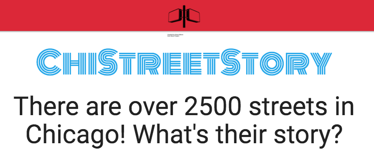
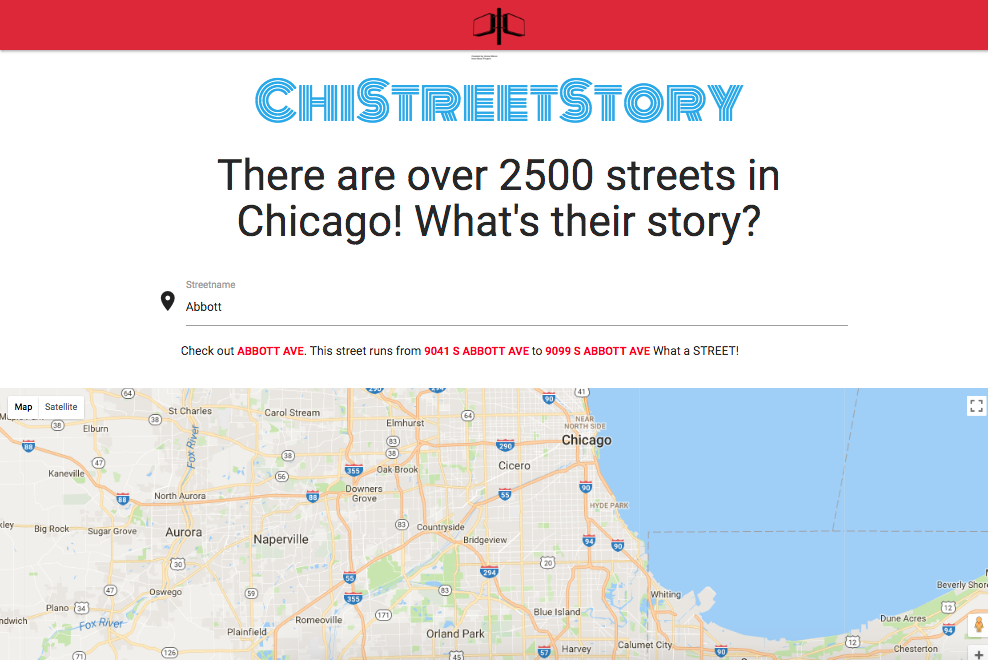
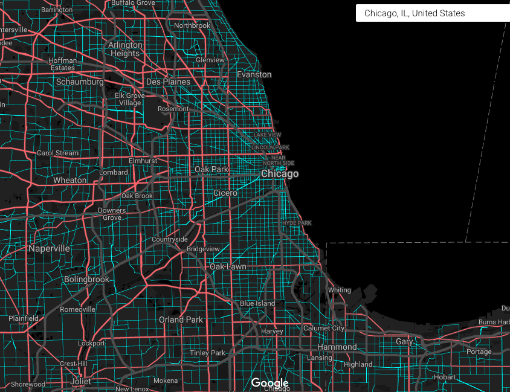

# ChiStreetStory [https://KaraAJC.github.io/chi-street-story](https://KaraAJC.github.io/chi-street-story)

ChiStreetStory is a site built from a hackathon during the [Nerd Immersion](https://www.nerdery.com/events/nerd-immersion-2017) event, put on by the [Nerdery](https://www.nerdery.com).

## About

It all started out with a lil' list of things I wanna build, and data sets that sounded interesting. it developed into curiosity about what services 311 provides, and frustration that it's not easy to find out who actually provides those services from Chicago. *Who's in charge around here?!*

### Who Lives, Who Dies, Who Tells Your Story 

I directed my attention towards the Street Names Data set, in the hopes of finding a `Kara Blvd`. It bubbled into a desire to find out: *Who Are these people with streets named after them? How are streets even named?!*

Along Came Chi-Street-Story.

WooHoos/Blockers/Curiosities:
- [Google Maps Style](https://mapstyle.withgoogle.com/) Customizing was fascinating!

- Street paths aren't as easy as I thought..
  (start/end not enough)
- I won 3rd place in the hackathon!

Next Steps:
- get a link(or content) on the history of that name
- map a path, and highlight the entire street on a map

## Goals

- [x] use the Chicago Data Portal
- [x] Find a street by name
- [ ] get a link(or content) on the history of that name(or street)
- [ ] highlight the street on a map

## Stretch Goals

- [ ] have a pronounciation of the street name "in chicagoan"
  - (maybe allow for folks to input a pronounciation)
- [ ] add honorary street names
- [ ] have a way for folks to request a street to be changed
- [ ] have a way to determine the cost of the name street change
  - only cost of street sign replacements, total cost would include maps, etc. [source](http://www.chicagomag.com/Chicago-Magazine/The-312/September-2013/Chicago-Street-Names/)

## Tools & Resources

  - Chicago Data Portal
    - [Chicago Street Names Dataset](https://data.cityofchicago.org/Transportation/Chicago-Street-Names/i6bp-fvbx/data)
    - [API for above dataset](https://dev.socrata.com/foundry/data.cityofchicago.org/pasq-g8mx)
  - Google Maps API
  - Materialize
  - [Chicagology info on street names](https://chicagology.com/chicagostreets/streetnames/)
  - [ChicagoMag article on what it takes to rename a street in Chicago](http://www.chicagomag.com/Chicago-Magazine/The-312/September-2013/Chicago-Street-Names/)
  - [Chicago Streets Info](http://www.chsmedia.org/househistory/nameChanges/start.pdf)
  - [Wikipedia list of Chicago Placename etymologies](https://en.wikipedia.org/wiki/List_of_Chicago_placename_etymologies)
  - [Honorary Chicago](http://www.honorarychicago.com/frequently-asked-questions-faq) : a site listing honorary chicago street names

  ## Thanks and Attributions
   - street sign in header by Amos Meron from [the Noun Project](https://thenounproject.com/term/street-sign/28140/)
   - Thanks to the Nerdery for making a fun hackathon on the Day of Civic Hacking!
